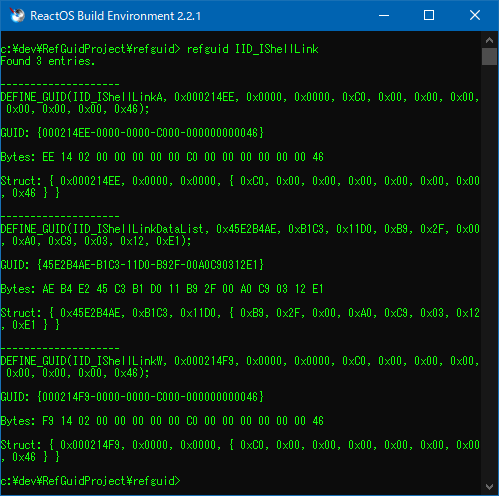

# refguid by katahiromz

This program `refguid` is a command line tool for Win32,
to search, convert, and/or generate GUIDs.

## Usage

```txt
refguid guid_name
refguid "guid_string"
refguid --search "search_string"
refguid --list
refguid --generate
refguid --help
refguid --version
```

## Screenshot



## License

- MIT

## Copyright

- Copyright © 2024 Katayama Hirofumi MZ.
